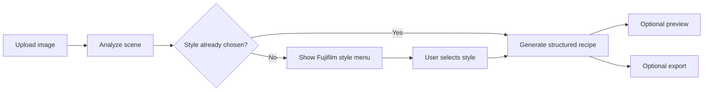

# FujiDay

FujiDay is a Fujifilm-first agentic grading system for Codex and Claude. It helps an agent analyze an image, require an explicit Fujifilm style choice, generate a structured film-simulation recipe, and optionally return an approximate preview or export.

FujiDay is intentionally conservative about what it claims:

- It does not silently guess a recipe before style selection.
- It treats a recipe as `base film simulation + supporting settings`, not as a magic preset.
- It does not claim exact Fujifilm in-camera JPEG reproduction.

## What FujiDay Does

FujiDay turns a vague "make this feel more Fuji" request into a guided workflow that is easier to understand and easier to repeat.

- It looks at the scene and summarizes the grading context.
- It shows the user the Fujifilm directions they can actually choose from.
- It returns a structured recipe, plus an approximate preview or export when requested.

## Who Should Read What

| Reader | Start Here | Why |
| --- | --- | --- |
| Users | [Quick Start](#quick-start) and [The Seven Fujifilm Styles](#the-seven-fujifilm-styles) | Understand the product flow and the available looks. |
| Agents | [`skills/using-fujiday/SKILL.md`](./skills/using-fujiday/SKILL.md) | This is the top-level routing and behavior contract. |
| Developers | [Commands and Runtime APIs](#commands-and-runtime-apis) and [docs/architecture.md](./docs/architecture.md) | See the public interfaces and system layout. |

## The Product Logic

FujiDay's main workflow is fixed on purpose:

1. User uploads an image.
2. FujiDay analyzes the scene.
3. FujiDay shows Fujifilm style choices if the user has not selected one yet.
4. User chooses a style.
5. FujiDay generates a structured recipe.
6. FujiDay can return an approximate preview or write an approximate export.



Non-negotiable product rules:

- FujiDay does not generate a Fujifilm recipe before the user selects a style.
- FujiDay separates the effect of the base Film Simulation from white balance, tone, color, dynamic range, grain, and Color Chrome settings.
- Preview and export outputs are approximate renders, not camera-exact Fujifilm JPEGs.

## The Seven Fujifilm Styles

These are the core color directions currently shipped in the bundled Fujifilm style pack.

| Key | Style | Character | Best For | Watch Out |
| --- | --- | --- | --- | --- |
| `provia` | `PROVIA / Standard` | Balanced, natural, everyday baseline | Daily shooting, mixed subjects, clean reference look | Can feel too plain when the brief needs stronger mood. |
| `velvia` | `Velvia / Vivid` | Saturated, scenic, high-impact color | Landscapes, travel, foliage, skies | Skin can turn aggressive and bright scenes can clip quickly. |
| `astia` | `ASTIA / Soft` | Soft, flattering, portrait-friendly | Portraits, fashion, gentle daylight | Can feel too gentle for gritty or graphic scenes. |
| `classic_chrome` | `Classic Chrome` | Muted, editorial, documentary | Street, travel, magazine-style color | Can feel too restrained for beauty-oriented portraits. |
| `classic_neg` | `Classic Neg.` | Nostalgic, denser shadows, negative-film mood | Everyday life, suburban memory, nostalgic street | Can over-darken dim scenes and make skin feel stern under poor light. |
| `eterna` | `ETERNA` | Low-contrast, cinematic, quiet scenes | Cinematic stills, quiet travel, video-like mood | May feel too flat if the user expects punch. |
| `acros` | `ACROS` | Deep monochrome, texture and tonal depth | Graphic black-and-white, texture-heavy work, monochrome portraits | Not suitable when the user still wants color information. |

## Quick Start

### Guided Interaction

Typical grading flow:

1. Upload an image.
2. Ask for FujiDay grading help.
3. FujiDay analyzes the scene and shows the Fujifilm menu.
4. Choose a style such as `Classic Chrome` or `ETERNA`.
5. FujiDay returns a recipe and, if requested, a preview or export path.

### CLI

Show the Fujifilm style menu for an image:

```bash
grade-fujifilm --image /absolute/path/to/photo.jpg
```

Generate a recipe directly:

```bash
grade-fujifilm --image /absolute/path/to/photo.jpg --style "Classic Chrome" --preview
```

Export an approximate graded render:

```bash
export-fujifilm --image /absolute/path/to/photo.jpg --style "ETERNA" --output /absolute/path/to/output.jpg
```

### Node Runtime

```js
const fujiday = require('./index.js');

async function run() {
  const result = await fujiday.generate_recipe({
    image_path: '/absolute/path/to/photo.jpg',
    selected_style: 'Classic Chrome',
    output_preview: true
  });

  console.log(result);
}

run();
```

## Installation

FujiDay currently documents three real entry points.

### Codex

```bash
git clone https://github.com/<owner>/FujiDay.git ~/.codex/FujiDay
cd ~/.codex/FujiDay
npm install
mkdir -p ~/.agents/skills
ln -s ~/.codex/FujiDay ~/.agents/skills/fujiday
```

Restart Codex after installation.

Detailed Codex notes: [docs/README.codex.md](./docs/README.codex.md)

### Claude

FujiDay ships a local Claude-facing plugin manifest plus the same shared runtime and skills bundle. Clone the repository, install dependencies, and point your Claude environment at the repository root so it can read:

- `skills/`
- `runtimes/`
- `.claude-plugin/plugin.json`

Detailed Claude notes: [docs/README.claude.md](./docs/README.claude.md)

### Local Development

```bash
git clone https://github.com/<owner>/FujiDay.git
cd FujiDay
npm install
```

## Example Output

FujiDay returns a structured recipe, not just an aesthetic description.

Example result, shortened for readability:

```json
{
  "status": "success",
  "analysis_provider": "openai",
  "selected_style": "Classic Chrome",
  "selected_target_style": "Classic Chrome",
  "image_observation": {
    "subject": "street",
    "lighting": "soft daylight",
    "contrast_risk": "medium",
    "skin_tone_importance": "low",
    "monochrome_suitability": "plausible",
    "portrait_priority": false,
    "high_contrast_scene": false,
    "night_scene": false,
    "summary": "Quiet street scene with gentle daylight and moderate contrast."
  },
  "recipe": {
    "base_film_simulation": "Classic Chrome",
    "wb": "Daylight",
    "wb_shift": "+1 Red, -2 Blue",
    "highlight": "0",
    "shadow": "+1",
    "color": "-1",
    "grain": "Weak",
    "dynamic_range": "DR100",
    "color_chrome": "Weak"
  },
  "rationale": "Classic Chrome is a good fit for subdued documentary color with moderate contrast control.",
  "compatibility_notes": "Newer bodies add extra controls such as Color Chrome FX Blue and Clarity.",
  "next_test_to_run": "Keep Classic Chrome fixed and compare Shadow +1 versus Shadow 0 on the same scene.",
  "preview_note": "Approximate preview only; this is not a camera-exact Fujifilm JPEG render."
}
```

## Commands and Runtime APIs

### Main CLI Commands

| Command | Purpose | Returns |
| --- | --- | --- |
| `grade-fujifilm` | Analyze an image and show the style-selection menu, or generate a recipe when `--style` is provided | Style menu or structured Fujifilm recipe |
| `compare-fujifilm` | Compare multiple Fujifilm styles for an image or textual goal | Ranked comparison and recommended style |
| `export-fujifilm` | Write an approximate graded JPG or PNG to disk | Export path plus recipe summary |

### Main Runtime Interfaces

| Function | Purpose | Returns |
| --- | --- | --- |
| `analyze_image` | Analyze the scene before style selection | Observation and recommended styles |
| `list_styles` | Turn an observation or textual goal into a ranked Fujifilm menu | Ranked style list |
| `generate_recipe` | Generate a structured Fujifilm recipe | Recipe, rationale, compatibility notes, optional preview |
| `export_render` | Write an approximate graded render to disk | Export path plus recipe summary |
| `compare_styles` | Compare multiple Fujifilm looks | Recommended style plus comparison notes |
| `execute` | Compatibility wrapper around `generate_recipe` | Same contract as recipe generation |

## Vision Providers

FujiDay supports five image-observation modes.

| Provider | Best For | API Key | Notes |
| --- | --- | --- | --- |
| `openai` | Hosted vision with the default FujiDay path | `OPENAI_API_KEY` or `FUJIDAY_VLM_API_KEY` | Uses OpenAI Chat Completions with image input. |
| `openai_compatible` | Compatible hosted endpoints | Optional, usually `FUJIDAY_VLM_API_KEY` | Uses an OpenAI-compatible `/v1/chat/completions` endpoint. |
| `ollama` | Local, low-cost image analysis | None by default | Uses a local Ollama server through `/api/chat`. |
| `minimax` | MiniMax image understanding through MCP | `MINIMAX_API_KEY` or `FUJIDAY_MINIMAX_API_KEY` | Uses MiniMax's official `understand_image` MCP tool. |
| `disabled` | Fully local fallback mode | None | Skips remote vision and falls back to heuristic analysis. |

Default provider resolution:

- `openai` when `OPENAI_API_KEY` or `FUJIDAY_VLM_API_KEY` is available
- `minimax` when MiniMax credentials exist and no OpenAI or generic FujiDay VLM settings are present
- otherwise `disabled`

## Additional Workflows

FujiDay also includes composition workflows, but they are secondary to the main Fujifilm grading path.

### Additional CLI Commands

| Command | Purpose |
| --- | --- |
| `analyze-composition` | Analyze Alex Webb-style layering and composition fit |
| `export-crop` | Export a crop from the selected crop mode |
| `compose-fujifilm` | Chain a crop workflow into a Fujifilm final render |
| `build-style-pack` | Validate and build style-pack data |

### Additional Runtime Interfaces

| Function | Purpose |
| --- | --- |
| `analyze_composition` | Return composition observations and recommendations |
| `list_crop_modes` | Show available crop modes |
| `recommend_crop` | Recommend crop logic before export |
| `export_crop` | Write a crop to disk |
| `compose_fujifilm` | Chain composition output into a Fujifilm render |

Bundled secondary workflows currently include:

- Alex Webb composition analysis
- crop export
- composition-to-Fujifilm chaining

## Image Handling

FujiDay normalizes EXIF orientation before analysis, crop planning, preview rendering, and file export. This keeps phone images and rotated JPEGs aligned so the model, crop coordinates, and final output all refer to the same upright frame.

If `generate_recipe()` is called with `delete_after: true`, FujiDay only deletes the source image after the recipe path finishes successfully. Failed analysis or preview generation does not remove the original file.

## Current Scope

FujiDay is deliberately scoped.

- Preview images are approximate simulations.
- Exported renders are approximate simulations.
- FujiDay does not claim exact Fujifilm JPEG reproduction.
- FujiDay v1 is Fujifilm-first and does not yet ship additional brand style packs.
- Composition v1 ships only the `alex-webb` pack.
- FujiDay is a grading workflow and runtime bundle, not a general-purpose photo editor or hosted SaaS.

## Development

```bash
npm install
npm run lint
npm test
npm run eval:fixtures
npm run eval:check
```

Useful references:

- [docs/architecture.md](./docs/architecture.md)
- [evals/README.md](./evals/README.md)
- [docs/README.codex.md](./docs/README.codex.md)
- [docs/README.claude.md](./docs/README.claude.md)

## Contributing

FujiDay is structured as a skills-plus-runtime repository. Keep the public claims aligned with the code, keep style-pack logic data-driven, and add tests for any user-facing runtime or skill behavior changes.

## License

MIT. See [LICENSE](./LICENSE).
